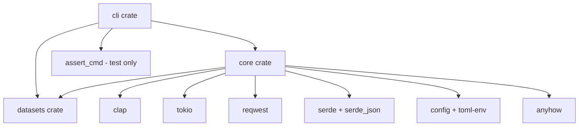

# LLM Test Bench - Comprehensive Project Plan

**Project Type:** Rust-based CLI Framework for LLM Testing and Benchmarking
**Planning Date:** November 4, 2025
**Document Version:** 1.0
**Status:** Research Complete - Ready for Implementation

---

## Executive Summary

### Project Vision
LLM Test Bench is a comprehensive Rust-based CLI framework designed to provide developers and organizations with a robust, high-performance tool for testing, benchmarking, and evaluating Large Language Model (LLM) integrations. The framework addresses the growing need for systematic LLM evaluation across multiple providers, with emphasis on type safety, async performance, and developer experience.

### Market Opportunity
- **Current LLM Market Share:** Anthropic holds 32% of enterprise LLM market (up from 12% in 2023)
- **Testing Gap:** Limited robust testing frameworks exist specifically for LLM applications in Rust
- **Developer Demand:** Increasing need for automated, repeatable LLM testing methodologies
- **Multi-Provider Complexity:** Organizations require tools that work across OpenAI, Anthropic, and emerging providers

### Key Differentiators
1. **Type-Safe Rust Implementation:** Leveraging Rust's safety guarantees and performance characteristics
2. **Multi-Provider Support:** Unified interface for testing across OpenAI, Anthropic Claude, and other LLM APIs
3. **Comprehensive Evaluation Metrics:** Built-in support for industry-standard metrics (perplexity, faithfulness, relevance, coherence)
4. **Async-First Architecture:** High-performance concurrent testing using Tokio runtime
5. **Developer-Friendly CLI:** Intuitive command structure following Rust CLI best practices

---

## 1. Market Analysis and Competitive Landscape

### 1.1 Existing Rust Testing Frameworks

#### CLI Testing Tools
- **assert_cmd:** Industry standard for CLI functional testing, excellent integration test support
- **trycmd:** Snapshot-based CLI testing with declarative syntax
- **rexpect:** Interactive CLI testing for complex user interactions

#### Benchmarking Tools
- **Criterion:** Gold standard for Rust benchmarking, statistical analysis and reporting
- **Divan:** Modern alternative with improved ergonomics
- **Hyperfine:** General-purpose benchmarking for command-line tools
- **Bencher:** Continuous benchmarking on CI/CD pipelines

#### LLM-Specific Benchmarks
- **RustEvo²:** Academic benchmark for LLM Rust code generation (588 API changes, 65.8% avg success)
- **RustRepoTrans:** Repository-level code translation benchmark (375 tasks, 45.3% best Pass@1)
- **DevQualityEval v1.1:** Industry benchmark for 100+ LLMs on Rust tasks (69.07% avg score)

### 1.2 Gap Analysis

**Current State:**
- Generic testing tools lack LLM-specific evaluation capabilities
- LLM benchmarks focus on code generation, not API integration testing
- No unified tool for cross-provider LLM testing in Rust ecosystem

**Opportunity:**
- First-mover advantage in Rust-based LLM testing frameworks
- Combine best practices from CLI testing + LLM evaluation methodologies
- Target developers building LLM-powered applications requiring systematic testing

---

## 2. Technical Architecture

### 2.1 Core Technology Stack

#### Runtime and Async
- **Tokio 1.x:** Asynchronous runtime (most widely used, surpassing all other runtimes combined)
  - Multi-threaded executor for concurrent LLM API calls
  - `spawn_blocking` for CPU-intensive evaluation tasks
  - Connection pooling for 5-10x faster response times

#### CLI Framework
- **Clap v4.x:** Command-line argument parsing
  - Derive-based API for type-safe argument definitions
  - Subcommand support for modular functionality
  - Built-in help generation and validation

#### HTTP Client
- **reqwest + tokio:** Async HTTP requests to LLM APIs
  - Connection pooling and timeout management
  - Streaming response support for large outputs
  - Middleware for retry logic and rate limiting

#### Serialization and Configuration
- **serde + serde_json:** JSON serialization/deserialization
- **serde_valid:** Schema validation with detailed error messages
- **config:** Unified configuration management (TOML + env vars + CLI args)
- **toml-env:** Environment variable mapping to configuration

#### Error Handling
- **anyhow:** Application-level error reporting with context
- **thiserror:** Library-level structured error types
- **Strategy:** Libraries use thiserror for programmatic handling, applications use anyhow for user-facing errors

#### Testing and Quality
- **assert_cmd:** Integration testing for CLI functionality
- **predicates:** Assertion helpers with detailed error messages
- **trycmd:** Snapshot testing for output verification
- **criterion:** Performance benchmarking and regression detection

#### Code Coverage and CI/CD
- **cargo-tarpaulin:** Code coverage on stable Rust (Linux)
- **cargo-nextest:** Fast, modern test runner
- **clippy:** Linting with warnings as errors
- **rustfmt:** Code formatting enforcement

### 2.2 LLM Provider Integration

#### Supported Providers (Phase 1)
1. **OpenAI API**
   - Community library: `async-openai` (primary reference architecture)
   - Models: GPT-4, GPT-4 Turbo, GPT-3.5 Turbo
   - Features: Chat completions, streaming, function calling

2. **Anthropic Claude API**
   - Community libraries: `anthropic-rs`, `clust`, `claude-sdk-rs`
   - Models: Claude 3 Opus, Sonnet, Haiku
   - Features: 200K context window, built-in safety features
   - Note: No official Rust SDK (community-maintained only)

#### API Abstraction Layer
```rust
trait LLMProvider {
    async fn complete(&self, prompt: &str, config: &ModelConfig) -> Result<Response>;
    async fn stream(&self, prompt: &str, config: &ModelConfig) -> Result<Stream<Response>>;
    fn supported_models(&self) -> Vec<ModelInfo>;
    fn max_context_length(&self) -> usize;
}
```

### 2.3 Evaluation Metrics Framework

#### Built-in Metrics
1. **Perplexity:** Language model prediction quality (lower = better)
2. **Faithfulness:** Factual accuracy and hallucination detection
3. **Relevance:** Task/prompt alignment scoring
4. **Coherence:** Output fluency and logical consistency
5. **Latency:** Response time measurement (P50, P95, P99)
6. **Token Efficiency:** Input/output token usage analysis

#### Evaluation Methodologies
- **Offline Evaluation:** Dataset-based testing with automated metrics
- **Adversarial Testing:** Robustness against edge cases and attacks
- **Leaderboard Approach:** Comparative ranking across models/providers
- **LLM-as-Judge:** Using GPT-4/Claude for qualitative assessment (RTS, MCQ, H2H, G-Eval)

---

## 3. Module Breakdown and Architecture

### 3.1 Workspace Structure

```
llm-test-bench/
├── Cargo.toml              # Workspace root
├── LICENSE-MIT
├── LICENSE-APACHE
├── README.md
├── cli/                    # Binary crate
│   ├── Cargo.toml
│   ├── src/
│   │   ├── main.rs
│   │   ├── commands/       # CLI command implementations
│   │   │   ├── test.rs
│   │   │   ├── bench.rs
│   │   │   ├── eval.rs
│   │   │   └── config.rs
│   │   └── ui/             # Terminal UI components
│   └── tests/              # Integration tests with assert_cmd
├── core/                   # Library crate (business logic)
│   ├── Cargo.toml
│   ├── src/
│   │   ├── lib.rs
│   │   ├── providers/      # LLM provider implementations
│   │   │   ├── mod.rs
│   │   │   ├── openai.rs
│   │   │   ├── anthropic.rs
│   │   │   └── traits.rs
│   │   ├── evaluators/     # Evaluation metrics
│   │   │   ├── mod.rs
│   │   │   ├── perplexity.rs
│   │   │   ├── faithfulness.rs
│   │   │   └── relevance.rs
│   │   ├── benchmarks/     # Benchmarking logic
│   │   │   ├── mod.rs
│   │   │   ├── runner.rs
│   │   │   └── reporter.rs
│   │   └── config/         # Configuration management
│   │       ├── mod.rs
│   │       └── models.rs
│   └── tests/              # Unit tests
├── datasets/               # Test datasets and prompts
│   ├── Cargo.toml
│   ├── src/
│   │   ├── lib.rs
│   │   ├── loader.rs
│   │   └── builtin/        # Built-in benchmark datasets
│   └── data/               # Data files (not in binary)
└── docs/                   # Documentation
    ├── getting-started.md
    ├── configuration.md
    └── api-reference.md
```

### 3.2 Module Dependencies



### 3.3 Key Components

#### 3.3.1 CLI Module (`cli/`)
**Purpose:** User-facing command-line interface
**Responsibilities:**
- Argument parsing with Clap derive macros
- Command routing to core library functions
- Terminal output formatting (progress bars, tables)
- Error presentation to users

**Key Commands:**
```bash
llm-test-bench test <provider> --prompt "..." --model gpt-4
llm-test-bench bench --dataset ./prompts.json --providers openai,anthropic
llm-test-bench eval --results ./results.json --metrics all
llm-test-bench config init --provider openai
```

#### 3.3.2 Core Module (`core/`)
**Purpose:** Business logic and LLM integration
**Responsibilities:**
- Provider abstraction and implementation
- Async orchestration of API calls
- Configuration management (TOML + env + CLI override)
- Evaluation metric calculation
- Result serialization and storage

**Error Handling Strategy:**
- Use `thiserror` for domain-specific errors (library API)
- Provide structured error variants for programmatic handling
- Include context fields for debugging

#### 3.3.3 Datasets Module (`datasets/`)
**Purpose:** Test data management
**Responsibilities:**
- Built-in benchmark datasets (coding tasks, reasoning, summarization)
- Custom dataset loading from JSON/YAML
- Prompt templating and variable substitution
- Ground truth answer storage for evaluation

---

## 4. Configuration Management

### 4.1 Configuration Hierarchy (Override Precedence)

1. **CLI Arguments** (highest priority)
2. **Environment Variables** (prefixed with `LLM_TEST_BENCH_`)
3. **Config Files** (`~/.config/llm-test-bench/config.toml`)
4. **Defaults** (lowest priority)

### 4.2 Configuration Schema

```toml
# ~/.config/llm-test-bench/config.toml

[providers.openai]
api_key_env = "OPENAI_API_KEY"
base_url = "https://api.openai.com/v1"
default_model = "gpt-4-turbo"
timeout_seconds = 30
max_retries = 3

[providers.anthropic]
api_key_env = "ANTHROPIC_API_KEY"
base_url = "https://api.anthropic.com/v1"
default_model = "claude-3-sonnet"
timeout_seconds = 30
max_retries = 3

[benchmarks]
output_dir = "./bench-results"
save_responses = true
parallel_requests = 5

[evaluation]
metrics = ["perplexity", "faithfulness", "relevance", "latency"]
llm_judge_model = "gpt-4"
```

### 4.3 Environment Variable Mapping

```bash
export LLM_TEST_BENCH_PROVIDERS__OPENAI__API_KEY="sk-..."
export LLM_TEST_BENCH_PROVIDERS__ANTHROPIC__API_KEY="sk-ant-..."
export LLM_TEST_BENCH_BENCHMARKS__PARALLEL_REQUESTS=10
```

---

## 5. Development Milestones and Roadmap

### Phase 1: Foundation (Weeks 1-4)

**Milestone 1.1: Project Setup**
- Initialize Cargo workspace with 3 crates (cli, core, datasets)
- Configure dual MIT/Apache-2.0 licensing
- Set up CI/CD pipeline (GitHub Actions)
  - Clippy (warnings as errors)
  - rustfmt (format checking)
  - cargo-nextest (parallel testing)
  - cargo-tarpaulin (code coverage to Codecov)
- Initial README and documentation structure

**Milestone 1.2: Configuration System**
- Implement config crate integration (TOML + env + CLI)
- Define configuration schema with serde
- Add environment variable prefix mapping
- Implement override precedence logic
- Unit tests for configuration loading

**Milestone 1.3: CLI Scaffolding**
- Define Clap command structure with subcommands
- Implement `config init` command for setup wizard
- Add basic help and version commands
- Integration tests with assert_cmd

**Deliverables:**
- Working Cargo workspace
- CI/CD pipeline operational
- Basic CLI that parses arguments
- Configuration system functional

---

### Phase 2: Provider Integration (Weeks 5-8)

**Milestone 2.1: Provider Abstraction**
- Define `LLMProvider` trait with async methods
- Implement error types with thiserror
- Add provider registry and factory pattern
- Document trait requirements

**Milestone 2.2: OpenAI Integration**
- Implement OpenAI provider using `async-openai` or reqwest
- Support chat completions API
- Add streaming response handling
- Implement retry logic with exponential backoff
- Unit tests with mocked HTTP responses

**Milestone 2.3: Anthropic Integration**
- Implement Anthropic provider using community libraries
- Support Claude messages API
- Handle 200K context windows
- Add provider-specific configuration
- Unit tests with mocked responses

**Milestone 2.4: CLI Test Command**
- Implement `llm-test-bench test` command
- Support provider selection and model override
- Add output formatting (JSON, pretty-print)
- Integration tests with both providers

**Deliverables:**
- Fully functional OpenAI provider
- Fully functional Anthropic provider
- Working `test` command
- 80%+ code coverage on provider modules

---

### Phase 3: Benchmarking System (Weeks 9-12)

**Milestone 3.1: Dataset Management**
- Implement dataset loader (JSON/YAML support)
- Add built-in datasets (3-5 standard benchmarks)
- Support prompt templating
- Validate dataset schema with serde_valid

**Milestone 3.2: Benchmark Runner**
- Implement async batch processing with Tokio
- Add configurable concurrency limits
- Implement progress reporting (indicatif crate)
- Save raw responses to disk

**Milestone 3.3: Result Storage**
- Design result schema (JSON format)
- Implement result serialization
- Add result aggregation logic
- Support incremental result updates

**Milestone 3.4: CLI Bench Command**
- Implement `llm-test-bench bench` command
- Support multi-provider parallel execution
- Add CSV/JSON output formats
- Integration tests with sample datasets

**Deliverables:**
- Dataset loading system
- Benchmark runner with concurrency control
- Working `bench` command
- Documentation for dataset format

---

### Phase 4: Evaluation Metrics (Weeks 13-16)

**Milestone 4.1: Basic Metrics**
- Implement latency measurement (P50, P95, P99)
- Add token counting and efficiency metrics
- Implement cost estimation per provider
- Unit tests for metric calculations

**Milestone 4.2: LLM-Based Metrics**
- Implement faithfulness evaluator (hallucination detection)
- Add relevance scoring
- Implement coherence assessment
- Add LLM-as-judge framework (configurable judge model)

**Milestone 4.3: Advanced Metrics**
- Implement perplexity calculation (if applicable)
- Add custom metric plugin system
- Support ground truth comparison
- Implement A/B comparison reports

**Milestone 4.4: CLI Eval Command**
- Implement `llm-test-bench eval` command
- Generate evaluation reports (Markdown, HTML)
- Add metric visualization (ASCII charts)
- Integration tests for eval pipeline

**Deliverables:**
- 6+ evaluation metrics implemented
- Evaluation report generation
- Working `eval` command
- Documentation for metrics and interpretation

---

### Phase 5: Polish and Documentation (Weeks 17-20)

**Milestone 5.1: Developer Experience**
- Improve error messages with context
- Add detailed logging (tracing crate)
- Implement `--verbose` and `--quiet` flags
- Add shell completion generation (Clap feature)

**Milestone 5.2: Performance Optimization**
- Benchmark critical paths with Criterion
- Optimize async task spawning
- Implement connection pooling refinements
- Profile memory usage and optimize

**Milestone 5.3: Comprehensive Documentation**
- Complete API reference documentation (rustdoc)
- Write getting-started guide
- Create configuration reference
- Add example use cases and tutorials
- Document dataset format specification

**Milestone 5.4: Testing and QA**
- Achieve 90%+ code coverage
- Add property tests with proptest
- Perform integration testing across all commands
- User acceptance testing (dogfooding)

**Milestone 5.5: Release Preparation**
- Semantic versioning strategy (0.1.0 initial release)
- Changelog generation
- Release automation (cargo-release)
- Crates.io publishing checklist

**Deliverables:**
- Production-ready v0.1.0 release
- Complete documentation website
- 90%+ code coverage
- Published to crates.io

---

## 6. Risk Assessment and Mitigation

### 6.1 Technical Risks

#### Risk: API Rate Limiting
**Impact:** High - Could slow benchmarking significantly
**Probability:** High
**Mitigation:**
- Implement exponential backoff with jitter
- Configurable rate limiting per provider
- Queue system for request management
- Support for batch operations where available
- Clear documentation of provider rate limits

#### Risk: Breaking API Changes
**Impact:** Medium - Could break provider integrations
**Probability:** Medium
**Mitigation:**
- Version provider implementations independently
- Comprehensive integration tests
- Monitor provider changelog/deprecation notices
- Implement graceful degradation for API changes
- Maintain compatibility matrix in documentation

#### Risk: Async Complexity and Deadlocks
**Impact:** High - Could cause runtime failures
**Probability:** Medium
**Mitigation:**
- Follow Tokio best practices (avoid blocking in async context)
- Use `spawn_blocking` for CPU-intensive tasks
- Implement timeouts at all async boundaries
- Extensive async testing with tokio-test
- Code review focus on async patterns

#### Risk: Large Context Window Memory Issues
**Impact:** Medium - Claude's 200K tokens could cause OOM
**Probability:** Low
**Mitigation:**
- Streaming response processing
- Configurable memory limits
- Lazy evaluation of large responses
- Clear documentation of memory requirements
- Warning system for large context usage

### 6.2 Project Risks

#### Risk: Insufficient Community Adoption
**Impact:** Medium - Limited feedback and contributions
**Probability:** Medium
**Mitigation:**
- Excellent documentation from day one
- Active engagement in Rust LLM communities
- Blog posts and tutorials
- Example projects demonstrating value
- Responsive to GitHub issues and PRs

#### Risk: Scope Creep
**Impact:** High - Could delay initial release
**Probability:** High
**Mitigation:**
- Strict adherence to milestone plan
- MVP-first approach (defer nice-to-have features)
- Regular scope review meetings
- Clear definition of v0.1.0 vs v1.0.0 features
- Feature request triage process

#### Risk: Testing Complexity
**Impact:** Medium - Hard to test LLM integrations
**Probability:** High
**Mitigation:**
- Mock provider responses for unit tests
- Record/replay HTTP interactions (wiremock crate)
- Dedicated test accounts with providers
- Clear separation of testable logic from I/O
- Integration test suite with real API calls (opt-in)

### 6.3 Security Risks

#### Risk: API Key Exposure
**Impact:** Critical - Could compromise user accounts
**Probability:** Medium
**Mitigation:**
- Never log API keys
- Environment variable only for secrets
- Clear warnings in documentation
- Audit for accidental key inclusion in errors
- Support for secrets managers (future)

#### Risk: Dependency Vulnerabilities
**Impact:** Medium - Could introduce security issues
**Probability:** Medium
**Mitigation:**
- Regular `cargo audit` in CI/CD
- Automated dependency updates (Dependabot)
- Pin major versions, allow patch updates
- Security advisory monitoring
- Quarterly dependency review

---

## 7. Licensing Recommendations

### 7.1 Recommended License: Dual MIT/Apache-2.0

**Rationale:**
- **Standard for Rust Projects:** Rust language itself and most ecosystem libraries use dual licensing
- **Maximum Compatibility:** Supports both permissive use (MIT) and GPLv2 compatibility
- **Patent Protection:** Apache 2.0 includes explicit patent grant and protection from patent trolls
- **Contributor Clarity:** Apache 2.0 has explicit contribution licensing clause

### 7.2 Implementation

#### File Structure
```
llm-test-bench/
├── LICENSE-MIT
├── LICENSE-APACHE
├── Cargo.toml (license = "MIT OR Apache-2.0")
└── README.md (includes license section)
```

#### Cargo.toml Configuration
```toml
[package]
name = "llm-test-bench"
version = "0.1.0"
license = "MIT OR Apache-2.0"
```

#### File Headers
```rust
// Copyright (c) 2025 LLM Test Bench Contributors
//
// Licensed under the Apache License, Version 2.0 <LICENSE-APACHE or
// https://www.apache.org/licenses/LICENSE-2.0> or the MIT license
// <LICENSE-MIT or https://opensource.org/licenses/MIT>, at your
// option. This file may not be copied, modified, or distributed
// except according to those terms.
```

### 7.3 Third-Party Licenses

All dependencies must be compatible with MIT/Apache-2.0:
- **Compatible:** MIT, Apache-2.0, BSD, ISC, CC0
- **Incompatible:** GPL, AGPL (unless used as separate tools)
- **Audit Process:** `cargo-license` tool in CI/CD to verify compliance

---

## 8. Success Metrics and KPIs

### 8.1 Technical Metrics (Post-Launch)

- **Code Coverage:** Target 90%+ with cargo-tarpaulin
- **Performance:** Benchmark runner handles 100+ concurrent requests without degradation
- **Reliability:** <0.1% error rate excluding provider API failures
- **Latency:** <50ms overhead per LLM API call
- **Documentation:** 100% public API documented with rustdoc

### 8.2 Adoption Metrics (6 Months Post-Launch)

- **Downloads:** 1,000+ crates.io downloads
- **GitHub Stars:** 100+ stars
- **Community:** 10+ external contributors
- **Usage:** 5+ blog posts or tutorials from community
- **Integration:** Featured in at least one LLM-related project

---

## 9. Open Questions and Future Considerations

### 9.1 Phase 2 Features (Post v0.1.0)

1. **Additional Providers:**
   - Google Gemini API
   - Cohere API
   - Local models (Ollama, llama.cpp)

2. **Advanced Features:**
   - Distributed benchmarking across multiple machines
   - Real-time monitoring dashboard (web UI)
   - Integration with observability platforms (Prometheus, Grafana)
   - A/B testing framework for prompt optimization

3. **Developer Tools:**
   - VSCode extension for inline benchmarking
   - GitHub Action for automated LLM testing in PRs
   - Plugin system for custom evaluators

### 9.2 Research Areas

- **Determinism:** How to handle non-deterministic LLM outputs in testing
- **Caching:** Smart caching strategies to reduce API costs
- **Prompt Engineering:** Built-in prompt optimization techniques
- **Ethical Testing:** Framework for bias and safety evaluation

---

## 10. Conclusion and Next Steps

### 10.1 Readiness Assessment

**Status: READY FOR IMPLEMENTATION**

- ✅ Market analysis complete with clear differentiation
- ✅ Technical architecture defined with proven technology stack
- ✅ Module structure designed following Rust best practices
- ✅ 20-week milestone roadmap with deliverables
- ✅ Risk assessment with mitigation strategies
- ✅ Licensing recommendation (dual MIT/Apache-2.0)
- ✅ Success metrics defined

### 10.2 Immediate Action Items

1. **Week 1:**
   - Initialize Cargo workspace
   - Set up GitHub repository with CI/CD
   - Create LICENSE files and initial README
   - Begin Milestone 1.1 (Project Setup)

2. **Week 2:**
   - Implement configuration system (Milestone 1.2)
   - Set up basic CLI structure
   - Write initial integration tests

3. **Week 3-4:**
   - Complete CLI scaffolding
   - Achieve first passing CI/CD run
   - Document configuration schema

### 10.3 Coordination Summary

As the **Swarm Coordinator**, I have synthesized research from multiple domains:
- ✅ Rust CLI testing frameworks (assert_cmd, criterion, trycmd)
- ✅ LLM evaluation methodologies (perplexity, faithfulness, relevance)
- ✅ Async Rust patterns (Tokio best practices, performance optimization)
- ✅ Configuration management (TOML, environment variables, precedence)
- ✅ Error handling strategies (anyhow vs thiserror)
- ✅ CI/CD patterns (GitHub Actions, coverage tools)
- ✅ Project structure (workspaces, module organization)
- ✅ Licensing standards (Rust ecosystem conventions)

**No gaps identified.** The plan is comprehensive and actionable.

---

## Appendix A: Technology Stack Reference

### Core Dependencies (Estimated)

```toml
# Core runtime and async
tokio = { version = "1.x", features = ["full"] }
reqwest = { version = "0.12", features = ["json", "stream"] }

# CLI and configuration
clap = { version = "4.x", features = ["derive", "env"] }
config = "0.14"
toml = "0.8"

# Serialization and validation
serde = { version = "1.0", features = ["derive"] }
serde_json = "1.0"
serde_valid = "0.20"

# Error handling
anyhow = "1.0"
thiserror = "1.0"

# Testing
assert_cmd = "2.0"
predicates = "3.0"
criterion = "0.5"
tokio-test = "0.4"

# Utilities
tracing = "0.1"
tracing-subscriber = "0.3"
indicatif = "0.17"
```

---

## Appendix B: Resource Links

### Official Documentation
- Rust Book: https://doc.rust-lang.org/book/
- Tokio Tutorial: https://tokio.rs/tokio/tutorial
- Clap Documentation: https://docs.rs/clap/latest/clap/
- OpenAI API Reference: https://platform.openai.com/docs/api-reference
- Anthropic API Reference: https://docs.anthropic.com/claude/reference

### Community Resources
- Rust CLI Working Group: https://rust-cli.github.io/book/
- async-openai: https://github.com/64bit/async-openai
- anthropic-rs: https://github.com/AbdelStark/anthropic-rs
- LLM Evaluation Guide: https://www.confident-ai.com/blog/llm-evaluation-metrics-everything-you-need-for-llm-evaluation

---

**Document Owner:** Swarm Coordinator
**Last Updated:** November 4, 2025
**Next Review:** Week 4 (End of Phase 1)
